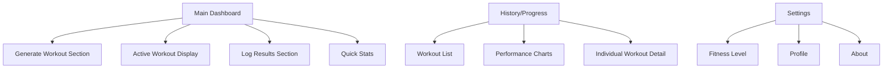
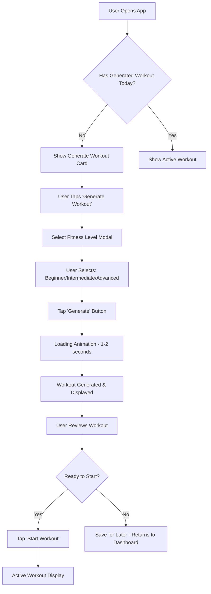
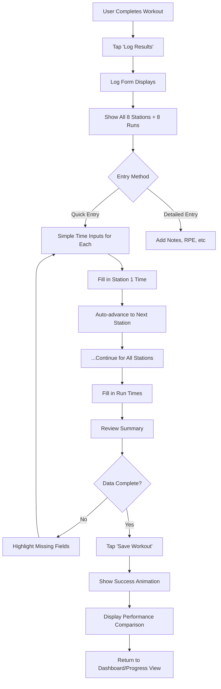

# Hyrox Workout Generator UI/UX Specification

**Version:** 1.0  
**Last Updated:** October 5, 2025  
**Status:** Ready for Development

---

## Introduction ^

This document defines the user experience goals, information architecture, user flows, and visual design specifications for **Hyrox Workout Generator**'s user interface. It serves as the foundation for visual design and frontend development, ensuring a cohesive and user-centered experience. ^

**Design Inspiration:** Cal AI app - clean, modern, mobile-first design with circular progress indicators, card-based layouts, and intuitive navigation. ^

### Overall UX Goals & Principles

#### Target User Personas

**Primary User: Dedicated Hyrox Athlete**
- Active Hyrox competitor training for events
- Uses app primarily on mobile during or around workouts
- Needs quick access to workout generation and logging
- Values simplicity, speed, and clear progress visualization
- Tech-savvy but wants intuitive, no-learning-curve interface

#### Usability Goals

1. **Instant clarity:** User understands current workout status within 2 seconds of opening app
2. **One-thumb operation:** All critical actions accessible with thumb on mobile
3. **Minimal taps:** Generate workout in 2 taps, log results in 3 taps
4. **Visual progress:** Performance trends visible at a glance with charts/graphs
5. **Fast loading:** App feels instant, no loading spinners for main screens

#### Design Principles

1. **Mobile-first simplicity** - Optimize for the phone in your hand at the gym
2. **Data-driven delight** - Make numbers beautiful and motivating
3. **Calm and focused** - Clean aesthetic that doesn't distract from training
4. **Tactile feedback** - Every tap feels responsive and satisfying
5. **Progress as motivation** - Celebrate improvements, visualize growth

#### Change Log

| Date | Version | Description | Author |
|------|---------|-------------|--------|
| 2025-10-05 | 1.0 | Initial UI/UX specification | Sally (UX Expert) |

---

## Information Architecture (IA)

### Site Map / Screen Inventory

### Navigation Structure

**Primary Navigation:** Bottom tab bar (Cal AI style) with 3 main sections:
- 🏠 **Home** - Main dashboard with workout generation, active workout, and quick stats
- 📊 **Progress** - History view with workout list and performance trends
- ⚙️ **Settings** - User preferences and profile

**Secondary Navigation:** 
- Within Home: Tab/accordion-style sections that expand/collapse (Generate, Current Workout, Quick Stats)
- Within Progress: Scroll-based timeline with filter options at top
- Large floating action button (FAB) for primary action: "Generate Workout" (accessible from any screen)

**Breadcrumb Strategy:** 
Not needed for MVP due to flat structure. Only 3 main screens with minimal depth.

---

## User Flows

### Flow 1: Generate Workout

**User Goal:** Quickly generate a personalized Hyrox workout based on fitness level

**Entry Points:** 
- Main dashboard "Generate Workout" section
- Floating Action Button (FAB) from any screen
- First-time user onboarding

**Success Criteria:** User receives a complete Hyrox workout plan with all 8 stations and running segments, ready to start training

#### Flow Diagram

#### Edge Cases & Error Handling:

- User closes app during generation → Save fitness level preference, auto-resume on return
- Network error during generation (if needed) → Use offline fallback algorithm, notify user
- User generates multiple workouts same day → Warn about overtraining, allow override
- User changes mind on fitness level → Easy "Regenerate" button visible

**Notes:** Keep this flow ultra-fast (2 taps maximum). The Cal AI pattern shows immediate data display - we want the same snappiness.

---

### Flow 2: Log Workout Results

**User Goal:** Quickly record performance data for a completed workout to track progress

**Entry Points:**
- "Log Results" button on completed active workout
- Main dashboard "Log Results" section
- History page "Add Manual Entry"

**Success Criteria:** All station times and running times logged, data saved to database, progress charts updated

#### Flow Diagram

#### Edge Cases & Error Handling:

- User starts logging but gets interrupted → Auto-save draft, restore on return
- User enters impossible time (e.g., 0:00 or 99:99) → Real-time validation, friendly error message
- User forgets to log immediately after workout → Allow manual entry from history, date picker
- User makes mistake after saving → Allow edit within 24 hours, show "edited" badge
- Partial workout completion → Allow logging completed stations only, mark as "incomplete"

**Notes:** Cal AI shows a very smooth, auto-advancing input pattern - we should mirror this. Each input should feel like progress toward completion, not a chore.

---

## Wireframes & Mockups

### Primary Design Files

**Design Tool:** To be created in Figma (recommended) or can be built directly in code given the tight timeline

**Design Reference:** Cal AI app screenshots provided as visual inspiration for aesthetic, layout patterns, and component style

### Key Screen Layouts

#### Screen 1: Main Dashboard (Home Tab)

**Purpose:** Central hub showing workout status, quick actions, and performance snapshot

**Key Elements:**
- **Header:** Simple logo/app name on left, streak indicator (🔥 1) on right (like Cal AI)
- **Current Workout Card** (Hero section):
  - Large card with rounded corners, subtle shadow
  - If no workout: "Generate Workout" CTA with inspiring text
  - If active workout: Progress ring showing stations completed (e.g., "3/8 stations") with circular progress indicator (Cal AI style)
  - Station preview and "Continue" button
- **Quick Stats Row** (3 cards in horizontal scroll):
  - Card 1: "This Week" - Workouts completed with mini progress bar
  - Card 2: "Best Time" - Personal record with small upward trend arrow
  - Card 3: "Streak" - Days trained consecutively
  - Each card: White background, rounded corners, icon + number + label
- **Recent Workouts Preview** (Bottom section):
  - "Recently completed" header
  - 2-3 workout cards showing date, time, and quick performance snapshot
  - "View all" link to Progress tab
- **Bottom Navigation Bar:** 3 tabs (Home, Progress, Settings) with icons
- **Floating Action Button (FAB):** Large circular "+" button (bottom right) for "Generate Workout"

**Interaction Notes:**
- Pull-to-refresh on entire page
- Cards have subtle press animation (scale down slightly on tap)
- Smooth scroll between sections
- FAB follows thumb position on scroll (always accessible)

**Design File Reference:** Main-Dashboard-Mobile.fig

---

#### Screen 2: Workout Generator Modal

**Purpose:** Quick selection interface for generating personalized workout

**Key Elements:**
- **Modal Overlay:** Slides up from bottom (iOS style), rounded top corners
- **Header:** "Generate Workout" title, close X button top-right
- **Fitness Level Selector:**
  - 3 large tap targets (Beginner / Intermediate / Advanced)
  - Card-based selection (similar to Cal AI's meal selection style)
  - Selected state: Bold border, filled background color
- **Generate Button:** Full-width, prominent, bottom of modal
- **Optional:** "Last generated: X hours ago" subtle text if applicable

**Interaction Notes:**
- Tap outside modal to dismiss
- Smooth slide-up animation on open
- Haptic feedback on selection
- Loading spinner on button after tap (1-2 seconds)
- Success animation then modal dismisses

**Design File Reference:** Generator-Modal-Mobile.fig

---

#### Screen 3: Active Workout Display

**Purpose:** Show complete workout details clearly for user to follow during training

**Key Elements:**
- **Progress Ring** (Top center):
  - Large circular progress indicator showing overall completion
  - Center text: "Station 1 of 8" or "3/8 Complete"
- **Current Station Card** (Hero):
  - Exercise name (large, bold): "SkiErg"
  - Prescription: "1000m" with icon
  - Timer/input area for logging time (optional for later)
- **Upcoming Stations List:**
  - Collapsed accordion showing next 2-3 stations
  - Light grey cards, smaller text
- **Action Buttons:**
  - Primary: "Complete Station" → Advances to next
  - Secondary: "Skip" (less prominent)
- **Bottom:** "Log Workout" button (appears when all stations done)

**Interaction Notes:**
- Swipe left/right to navigate between stations
- Circular progress animates smoothly as stations complete
- Checkmark animation when marking complete
- Celebration confetti when final station logged

**Design File Reference:** Active-Workout-Mobile.fig

---

#### Screen 4: Progress/History Tab

**Purpose:** Visualize training trends and review past workouts (Cal AI Progress screen)

**Key Elements:**
- **Header:** "Progress" title, filter icon (top-right)
- **Calendar Strip** (Top):
  - Horizontal scrolling week view (T, F, S, S, M, T, W)
  - Dates below, current day highlighted (red circle like Cal AI)
  - Dots under days with logged workouts
- **Performance Overview Card:**
  - Large number: Total workouts this month
  - Trend indicator: +X from last month
  - Mini line chart showing workout frequency
- **Recent Workouts List:**
  - Card per workout showing:
    - Date and time
    - Overall duration (large)
    - Station breakdown (mini circular indicators for each station)
    - Tap to expand for details
- **Charts Section** (Scrollable):
  - "Average Station Times" bar chart
  - "Running Performance" line chart
  - Cal AI style: Clean, colorful, easy to read

**Interaction Notes:**
- Scroll calendar to see other weeks
- Tap workout card to expand in-place or open detail modal
- Pull-to-refresh to sync latest data
- Smooth chart animations on load

**Design File Reference:** Progress-Tab-Mobile.fig

---

## Component Library / Design System

### Design System Approach

**Approach:** Leverage **Tailwind CSS** with a minimal custom component set. Use Tailwind's default design tokens (colors, spacing, etc.) to ship faster, with light customization to match Cal AI aesthetic.

**Component Strategy:** Build only what's absolutely necessary for MVP:
- Reusable UI primitives (Button, Card, Input)
- Specialized workout components (WorkoutCard, StationInput)
- Keep it simple, add complexity later

### Core Components (MVP Only)

#### Component: Button

**Purpose:** Primary action triggers throughout the app

**Variants:**
- Primary (filled, bold color for main actions like "Generate Workout")
- Secondary (outline style for less important actions)
- Icon button (for close X, settings, etc.)

**States:** Default, Hover, Pressed, Disabled, Loading

**Usage Guidelines:** Use primary for main actions, secondary for cancel/back. Keep text short (1-2 words).

---

#### Component: Card

**Purpose:** Container for workout data, stats, and content sections

**Variants:**
- Standard (white background, rounded corners, shadow)
- Interactive (adds press animation when tappable)

**States:** Default, Pressed (scale down slightly)

**Usage Guidelines:** Use for all major content blocks. Maintain consistent padding and corner radius.

---

#### Component: Progress Ring

**Purpose:** Circular progress indicator (Cal AI signature element)

**Variants:**
- Large (for main workout progress)
- Small (for individual stats cards)

**States:** Empty, Partial (animated fill), Complete (with checkmark)

**Usage Guidelines:** Use for completion tracking. Animate smoothly. Center text shows progress fraction.

---

#### Component: Input Field

**Purpose:** Time entry for logging workout results

**Variants:**
- Time input (MM:SS format)
- Number input (for reps/weights if needed later)

**States:** Empty, Focused, Filled, Error

**Usage Guidelines:** Auto-format time inputs. Auto-advance to next field on valid entry. Clear error states.

---

## Branding & Style Guide

### Visual Identity

**Brand Guidelines:** Hyrox Workout Generator uses a clean, modern, fitness-focused aesthetic inspired by Cal AI. The design emphasizes clarity, motivation, and data visualization with a friendly, approachable feel.

**Design Philosophy:** Calm yet energizing. Professional without being clinical. Make numbers inspiring, not intimidating.

### Color Palette

| Color Type | Hex Code | Usage |
|------------|----------|-------|
| Primary | `#E63946` | Primary actions, active workout indicators, primary brand color (energetic red) |
| Secondary | `#457B9D` | Secondary actions, chart accents, running segments (calm blue) |
| Accent | `#F77F00` | Highlights, streak indicators, celebratory elements (energetic orange) |
| Success | `#06D6A0` | Completed workouts, achievements, positive feedback |
| Warning | `#FCA311` | Cautions, rest day reminders, important notices |
| Error | `#D62828` | Errors, validation issues, destructive actions |
| Neutral | `#F8F9FA` (bg), `#212529` (text), `#DEE2E6` (border) | Backgrounds, text, borders, inactive states |

**Color Usage Notes:**
- Use Primary (`#E63946`) for FAB, main CTAs, active progress rings
- Neutral backgrounds (`#F8F9FA`) for app background, white (`#FFFFFF`) for cards
- Color-code station types if desired (SkiErg=blue, Sled=red, etc.) - but keep it optional for MVP

### Typography

#### Font Families

- **Primary:** `Inter` or `System UI` (clean, modern, excellent readability on mobile)
- **Secondary:** Same as primary (keep it simple for MVP)
- **Monospace:** `SF Mono` or `system-ui monospace` (for time displays: MM:SS)

#### Type Scale

| Element | Size | Weight | Line Height |
|---------|------|--------|-------------|
| H1 | `32px` / `2rem` | 700 (Bold) | 1.2 |
| H2 | `24px` / `1.5rem` | 600 (Semibold) | 1.3 |
| H3 | `20px` / `1.25rem` | 600 (Semibold) | 1.4 |
| Body | `16px` / `1rem` | 400 (Regular) | 1.5 |
| Small | `14px` / `0.875rem` | 400 (Regular) | 1.4 |
| Caption | `12px` / `0.75rem` | 400 (Regular) | 1.3 |
| Button | `16px` / `1rem` | 600 (Semibold) | 1 |
| Number Large | `48px` / `3rem` | 700 (Bold) | 1.1 (for main stats) |

**Typography Notes:**
- Use H1 sparingly (screen titles only)
- Numbers/stats should be bold and large to match Cal AI
- Body text at 16px minimum for mobile readability
- Time displays (MM:SS) use monospace for alignment

### Iconography

**Icon Library:** [Lucide Icons](https://lucide.dev/) or [Heroicons](https://heroicons.com/)

**Icon Style:** Outline style (stroke-based), consistent 2px stroke weight, 24px default size

**Usage Guidelines:**
- Use icons sparingly - only when they add clarity
- Tab bar icons: home, bar-chart, settings
- Action icons: plus (FAB), clock (time), fire (streak)
- Keep icon + label pairs for critical navigation

### Spacing & Layout

**Grid System:** 
- Mobile-first, single column layout
- Max content width: `640px` (Tailwind `max-w-2xl`)
- Horizontal padding: `16px` / `1rem` on mobile
- Card spacing: `12px` / `0.75rem` gap between cards

**Spacing Scale:** (Tailwind defaults)
- `xs`: `4px` - tight spacing within components
- `sm`: `8px` - component internal padding
- `md`: `16px` - standard spacing, page padding
- `lg`: `24px` - section spacing
- `xl`: `32px` - major section breaks
- `2xl`: `48px` - hero sections

**Border Radius:**
- Cards: `12px` / `0.75rem` (rounded-xl)
- Buttons: `8px` / `0.5rem` (rounded-lg)  
- Progress rings: `50%` (fully circular)
- Inputs: `8px` / `0.5rem`

**Shadows:**
- Cards: `0 1px 3px rgba(0,0,0,0.1)` (subtle)
- FAB: `0 4px 12px rgba(230,57,70,0.3)` (elevated, with primary color tint)
- Modal: `0 10px 40px rgba(0,0,0,0.2)` (prominent)

---

## Accessibility Requirements

### Compliance Target

**Standard:** WCAG 2.1 Level AA (baseline for good accessibility)

For MVP, we'll focus on foundational accessibility that doesn't add significant development time but ensures the app is usable by everyone.

### Key Requirements

**Visual:**
- Color contrast ratios: Minimum 4.5:1 for text, 3:1 for large text and UI components
- Focus indicators: 2px solid outline on all interactive elements (Tailwind's default focus ring)
- Text sizing: Base 16px, all text scalable with browser zoom

**Interaction:**
- Keyboard navigation: Tab through all interactive elements in logical order
- Screen reader support: Semantic HTML, proper labels on all inputs and buttons
- Touch targets: Minimum 44×44px tap targets (especially important for mobile workout logging)

**Content:**
- Alternative text: Icons paired with text labels (especially in navigation)
- Heading structure: Logical H1→H2→H3 hierarchy on each screen
- Form labels: All inputs have visible or aria-labels

### Testing Strategy

**MVP Testing:**
- Manual keyboard navigation test on each screen
- Test with iOS VoiceOver (since primary mobile platform)
- Chrome DevTools Lighthouse accessibility audit
- Manual color contrast check on key UI elements

---

## Responsiveness Strategy

### Breakpoints

| Breakpoint | Min Width | Max Width | Target Devices |
|------------|-----------|-----------|----------------|
| Mobile | `0px` | `639px` | iPhone, Android phones (primary) |
| Tablet | `640px` | `1023px` | iPad, Android tablets (optional support) |
| Desktop | `1024px` | `1535px` | Laptops, desktop monitors (nice to have) |
| Wide | `1536px` | - | Large displays (not prioritized) |

### Adaptation Patterns

**Layout Changes:**
- Mobile: Single column, full-width cards with 16px side padding
- Tablet: Max width container (640px) centered, slightly larger cards
- Desktop: Same as tablet (app stays mobile-optimized even on desktop)

**Navigation Changes:**
- Mobile: Bottom tab bar (thumb-accessible)
- Tablet/Desktop: Same bottom tab bar (keep consistency, no sidebar needed)

**Content Priority:**
- Mobile: Stack everything vertically, hide secondary info in expandable sections
- Larger screens: Same layout (mobile-first means mobile-always for this app)

**Interaction Changes:**
- Mobile: Touch targets, swipe gestures
- Desktop: Hover states, keyboard shortcuts (optional for MVP)

---

## Animation & Micro-interactions

### Motion Principles

**Principles:**
- **Purposeful, not decorative** - Animations provide feedback or guide attention
- **Fast and snappy** - 150-300ms for most transitions (feels instant)
- **Respectful** - Honor user's reduced motion preferences
- **Celebrate progress** - Use animation to make achievements feel rewarding

### Key Animations

- **Card Press:** Scale down to 98% (Duration: 150ms, Easing: ease-out)
- **Page Transition:** Slide from right/fade (Duration: 250ms, Easing: ease-in-out)
- **Progress Ring Fill:** Smooth circular fill (Duration: 800ms, Easing: ease-in-out)
- **Modal Appear:** Slide up from bottom (Duration: 300ms, Easing: ease-out)
- **Success Checkmark:** Scale + fade in (Duration: 400ms, Easing: spring)
- **FAB Tap:** Scale + ripple (Duration: 200ms, Easing: ease-out)
- **Station Complete:** Confetti burst (Duration: 1000ms) - optional celebration

---

## Performance Considerations

### Performance Goals

- **Page Load:** < 2 seconds on 3G mobile (first contentful paint)
- **Interaction Response:** < 100ms for tap feedback
- **Animation FPS:** 60fps for all animations

### Design Strategies

**Strategies:**
- Lazy load Progress/History tab content
- Use Next.js Image component for any future imagery
- Keep initial bundle small (< 200KB gzipped)
- Minimize use of heavy chart libraries (use lightweight alternatives or CSS-only visualizations for MVP)
- PWA caching for instant subsequent loads

---

## Next Steps

### Immediate Actions

1. **Review this spec with stakeholders** (you!) - confirm alignment before building
2. **Set up Next.js project** with Tailwind CSS configured
3. **Build component library** - Start with Button, Card, Input components
4. **Implement Main Dashboard** as first screen
5. **Create workout generation flow** end-to-end
6. **Build workout logging interface**
7. **Add Progress/History view** last

### Design Handoff Checklist

- [x] All user flows documented
- [x] Component inventory complete
- [x] Accessibility requirements defined
- [x] Responsive strategy clear
- [x] Brand guidelines incorporated
- [x] Performance goals established

---

**Document End**
